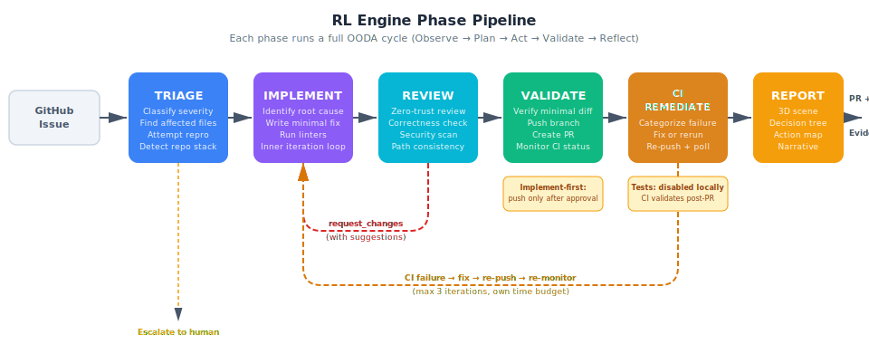
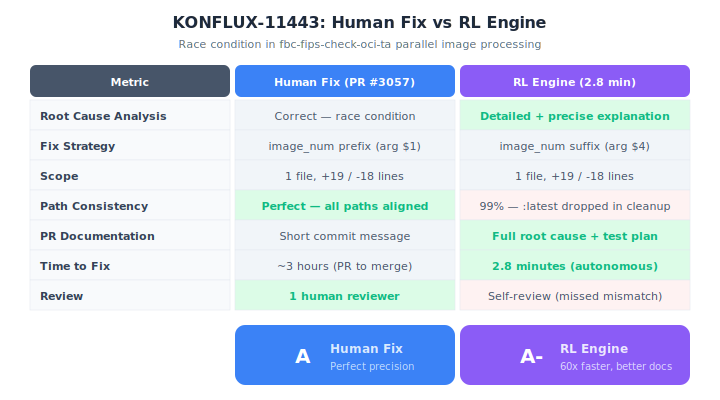
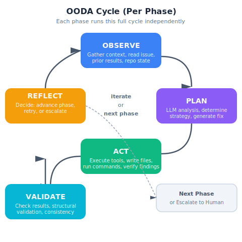
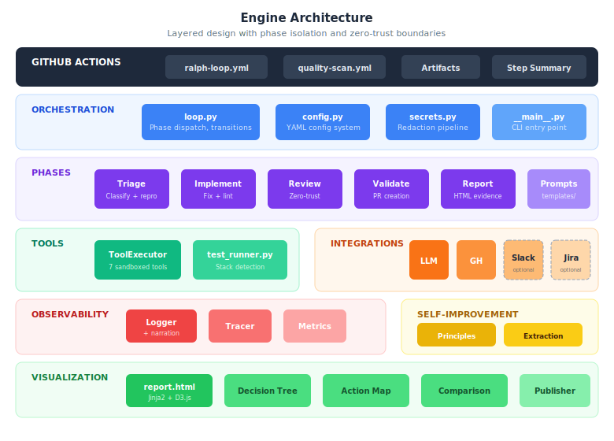

# RL Bug Fix Full Send

An agentic SDLC engine — developed and maintained using **Ralph Loops** — that autonomously triages, implements, reviews, and reports on bug fixes in GitHub-hosted repositories.

<!-- Overview diagram rendered inline as SVG below -->

## What Does It Do?

Given a GitHub issue describing a bug, the engine:

1. **Triages** it — classifies severity, identifies affected files, attempts reproduction
2. **Implements** a fix — reads code, identifies root cause, writes a minimal patch, runs linters
3. **Self-reviews** the fix — independent zero-trust review for correctness, intent alignment, security, and scope
4. **Validates** and opens a PR — verifies minimal diff, generates a detailed PR description, pushes to the target repo
5. **Monitors CI** — polls the target repo's CI pipeline after PR creation; if CI fails, categorizes the failure (test, build, lint, flake) and either fixes the code and re-pushes, triggers a rerun, or escalates
6. **Reports** — produces interactive HTML evidence (decision trees, action maps, execution traces)

If the engine gets stuck, it **escalates to a human** with full context of everything it tried.

The engine runs entirely in **GitHub Actions** — no local setup required for production use.



## Production Results

The engine has been validated against real [Konflux](https://github.com/konflux-ci) bugs with known human fixes.

### KONFLUX-11443: Race Condition in FIPS Check

**Bug**: The `fbc-fips-check-oci-ta` Tekton task failed inconsistently during parallel image processing — temp file paths collided when images shared identical `component-version-release` labels.

Both fixes identified the same root cause and used the same strategy (make temp paths unique per parallel job). The engine matched the human's solution in **2.8 minutes** with better documentation. The human fix scored higher on precision — every path was perfectly consistent, while the engine dropped a `:latest` suffix in one cleanup path.

This analysis led directly to improvements: a **deterministic path-consistency checker** now catches these mismatches automatically (see [Continuous Improvement](#continuous-improvement)).



## What is a Ralph Loop?

A Ralph Loop is our adaptation of the [Ralph Wiggum Loop](https://ghuntley.com/ralph/), an agentic iteration pattern created by Geoffrey Huntley in 2025. The core idea:

> Run an AI agent in a loop. Feed failures back as context. Iterate until an objective success criterion is met. **Iteration beats perfection; failures are data.**

A Ralph Loop **built this engine** — 64 iterations of a human + AI agent on a laptop, feeding production run failures back as context until the engine worked against real bugs. A Ralph Loop also **maintains** this engine — when a production run reveals a deficiency, the meta loop feeds that evidence into the next development session.



### The Ralph Loop vs the Production Engine

| | Ralph Loop (development methodology) | Production Engine (what it built) |
|---|---|---|
| **What it is** | A simple iterate-until-done loop: run agent → observe failure → feed back → repeat | A phased OODA pipeline with specialized phases, zero-trust validation, and bounded backtracking |
| **Where it runs** | Your laptop (Cursor, Claude Code, etc.) | GitHub Actions |
| **Loop structure** | Unstructured — same prompt, evolving codebase | Structured — 5 phases with different prompts, tools, and trust boundaries |
| **Iteration** | Every run is a full retry with fresh context | Only the implement↔review cycle iterates; other phases are single-shot |
| **Failure handling** | Failures are raw context for the next run | Failures trigger structured backtracking, escalation, or retry with exponential backoff |

The meta loop built the production system over 68 iterations (see [progress/run-log.md](progress/run-log.md)). The production engine then runs autonomously in CI. The engine borrows the Ralph Loop **philosophy** (iteration beats perfection, failures are data) but implements something architecturally richer: a phased pipeline where each phase runs an independent OODA decision cycle, phases validate each other with zero trust, and the implement↔review boundary is the only true iterative loop.

## Architecture



### Engine Components

| Layer | Module | Responsibility |
|-------|--------|----------------|
| **Orchestration** | `engine/loop.py` | Phased pipeline: dispatch, transitions, iteration cap, time budget, escalation, retry backoff, CI monitoring sub-loop |
| **Phases** | `engine/phases/` | Triage, implement, review, validate, CI remediate, report — each with OODA cycle |
| **Tools** | `engine/tools/executor.py` | Sandboxed file ops, shell commands, git operations (7 tools) |
| **LLM** | `engine/integrations/llm.py` | Gemini (primary) + Anthropic (fallback), provider-agnostic interface |
| **Integrations** | `engine/integrations/` | GitHub (core), Slack and Jira (optional, off by default) — all with injection guards |
| **Observability** | `engine/observability/` | Structured JSON logging, action tracing, metrics, live narration |
| **Visualization** | `engine/visualization/` | Self-contained HTML reports (no CDN dependencies, works offline), vendored Three.js 3D scene with OrbitControls, D3.js decision trees and action maps, comparison views with ghost objects, narrative detail drill-down panels (`narrative/formatter.py`), timeline scrubber (`scene/timeline.py`), narrative summary landing page (`narrative/summary.py`), 3D scene graph builder (`scene/builder.py`), configurable `visualization_engine` (threejs/d3) |
| **Security** | `engine/secrets.py` | Secret loading, validation, redaction across all outputs |
| **Observer** | `engine/observer/` | Neutral observer: execution reconstruction, cross-checking, in-toto attestation, Sigstore signing, policy evaluation |
| **Self-improvement** | `engine/golden_principles.py` | AST-based static analyzer enforcing 7 golden principles |

### Phase Pipeline

```
┌──────────┐     ┌───────────┐     ┌──────────┐     ┌──────────┐     ┌──────────┐
│  TRIAGE  │────►│ IMPLEMENT │────►│  REVIEW  │────►│ VALIDATE │────►│  REPORT  │
│          │     │           │     │          │     │          │     │          │
│ classify │     │ root cause│     │ zero-trust│    │ tests    │     │ HTML     │
│ severity │     │ write fix │     │ correctness   │ lint     │     │ decision │
│ find files│    │ test/lint │     │ security │     │ PR create│     │ tree     │
│ reproduce│     │ iterate   │     │ scope    │     │ CI check │     │ action   │
│          │     │           │     │          │     │          │     │ map      │
└──────────┘     └───────────┘     └──────────┘     └──────────┘     └──────────┘
                       ▲                 │
                       │    reject       │
                       └─────────────────┘
                    (request_changes with
                     specific suggestions)
```

Each phase uses **phase-specific prompts** (in `templates/prompts/`) and **phase-specific tool restrictions** (e.g., the review phase cannot write files or run shell commands — it can only read).

### Security Model

The engine treats all external data as **untrusted** and wraps it in delimiters before passing to the LLM:

| Source | Trust Level | Handling |
|--------|-------------|----------|
| Issue body | UNTRUSTED | Wrapped in delimiters, never in system prompts |
| Code diff | UNTRUSTED | Wrapped in delimiters, reviewed independently |
| Slack messages | UNTRUSTED | Wrapped by integration adapter |
| Jira data | UNTRUSTED | Wrapped by integration adapter |
| System prompts | TRUSTED | Never contain user-supplied data |
| Config | TRUSTED | From repo, not from user input |
| Prior phase output | VERIFIED | Each phase re-reads source material independently |

- **127 prompt injection tests** verify that untrusted content never leaks into system prompts
- **59 security audit tests** verify commit signing, provenance recording, secret redaction
- All secrets redacted from logs, traces, artifacts, and LLM transcripts

### Neutral Observer and Agent Provenance

A **neutral observer** runs as a separate GitHub Actions job after the agent finishes. It independently reconstructs what the agent did from artifacts, cross-checks claims against evidence, and produces a **signed provenance attestation** the agent cannot forge. This is the same architectural pattern as [Tekton Chains](https://tekton.dev/docs/chains/) in Konflux — a separate controller watches the build and signs attestations with credentials the build process never had access to.

```
Agent Job                          Observer Job (separate runner, separate secrets)
─────────                          ────────────────────────────────────────────────
phases run → upload artifacts  →   download artifacts
                                   reconstruct execution timeline
                                   cross-check claims vs evidence
                                   build in-toto attestation
                                   sign with Sigstore (OIDC)
                                   evaluate policy gates
                                   upload signed attestation
```

**Trust model**: The observer does not trust the agent's self-reported data. It reconstructs what happened from artifacts and verifies consistency. The attestation is signed with a credential the agent never had access to (GitHub Actions OIDC bound to the observer job). A compromised agent cannot forge a valid attestation.

**Five cross-checks** run on every execution:

| Check | What it verifies |
|-------|-----------------|
| Diff consistency | Git diff on the branch matches `file_changes` in `execution.json` |
| Action completeness | Every modified file has a corresponding action record |
| Phase ordering | Phases ran in declared order, no skipped validation |
| Token plausibility | LLM token counts are within plausible bounds |
| Tool call integrity | Tool calls in transcripts have matching action records |

**Five policy rules** evaluate the signed attestation:

| Rule | What it enforces |
|------|-----------------|
| Model allowlist | Only approved LLM models were used |
| Prompt integrity | Prompt template digests match known-good values |
| Scope compliance | Modified files relate to the issue (not arbitrary changes) |
| Cross-checks | All required cross-checks passed |
| Iteration limits | Iteration count within configured maximum |

**Attestation format**: [in-toto Statement v1](https://github.com/in-toto/attestation/blob/main/spec/v1/statement.md) with predicate type `https://rl-engine.dev/provenance/agent/v1`, aligned with SLSA Build provenance structure. Captures: subject (commit SHA), model identity, prompt digests, tool definitions, materials, and cross-check results.

**Configure** in `.rl-config.yaml`:

```yaml
observer:
  enabled: true
  signing_method: "sigstore"  # sigstore | cosign-key | none
  policy_file: "templates/policies/default.yaml"
  model_allowlist:
    - "gemini-2.5-pro"
    - "claude-sonnet-4-20250514"
  fail_on_policy_violation: false  # true = policy failure blocks the workflow
```

Run the observer locally (without signing):

```bash
python -m engine.observer --artifacts-dir ./output --skip-signing --output-dir ./attestation
```

### Testing Strategy: CI-First (Tests Are Disabled)

**Test execution is disabled by default.** This is a deliberate architectural decision, not a missing feature.

The engine targets arbitrary GitHub repositories. Running their test suites inside the GitHub Actions runner is unreliable and risky because:

- The correct language runtime/version may not be installed
- Dependencies may require Docker, databases, kind clusters, or specialized infrastructure the runner lacks
- Test suites may exceed timeouts (real suites can run 20+ minutes)
- Pre-existing flaky tests waste the iteration budget chasing unrelated failures
- Executing arbitrary shell commands from untrusted repos is a security surface

**Instead, the engine relies on the target repo's own CI pipeline** — which has the correct build matrix, services, secrets, and infrastructure — to validate the fix after the PR is created.

| Mode | Behavior | When Used |
|------|----------|-----------|
| `disabled` (default) | Tests skipped entirely; linting still runs | All repos unless configured otherwise |
| `opportunistic` | Tests run but failures don't block the loop | Auto-promoted when `test_command` is configured in `.rl-config.yaml` |
| `required` | Tests must pass before PR is created | Explicitly set in `.rl-config.yaml` |

Configure via `.rl-config.yaml` in the target repo:

```yaml
phases:
  implement:
    test_command: "go test ./..."
    test_execution_mode: "opportunistic"  # or "required"
  validate:
    test_command: "go test ./..."
    test_execution_mode: "opportunistic"
```

**Linting is always enabled** — it's cheap, fast, and works across repos without special infrastructure.

## Continuous Improvement

The engine improves itself through multiple feedback mechanisms:

| Feedback Source | Analysis | Improvement |
|----------------|----------|-------------|
| `execution.json` from production runs | Deterministic checks (path consistency, paired operations) | Prompt updates (`review.md`, `implement.md`) + code safety nets (`review.py`) |
| Repeated LLM call patterns | Pattern detection (`extraction.py`) | Deterministic tool proposals replacing expensive LLM calls |
| Engine source code | Golden principles (7 structural properties) | AST-based enforcement via `golden_principles.py` |
| Code metrics + scan results | Background quality scanner | Weekly cron scan + auto-created GitHub issues on critical findings |

**Recent improvement (Run 51)**: After comparing the engine's fix for KONFLUX-11443 against the human fix, we identified that the self-review phase missed a subtle OCI tag mismatch (`:latest` dropped from a cleanup path). Three changes were made:

1. **Review prompt** — added "Consistency of Paired Operations" as review dimension #6
2. **Implement prompt** — added "Consistency Requirements" section for path/parameter alignment
3. **Deterministic checker** — `_check_path_consistency()` in `review.py` runs post-LLM as a safety net, catching path mismatches the LLM might miss

**Improvement (Run 52 — PR #4 grading)**: Grading the latest engine PR against the human fix revealed that the path-consistency checker produced a **false positive** — it flagged the OCI URI tag (`:latest`) as a path mismatch when it's actually expected behavior (OCI tools write to the directory path, not the tag-suffixed path). This cost an unnecessary implement→review round trip (~3 min). Additionally, PR title/description quality was poor. Three fixes:

1. **OCI URI awareness** — `_check_path_consistency()` now tracks which creation paths originated from OCI URIs and skips the tag-mismatch finding for those (the tag is an image reference, not a filesystem component)
2. **LLM-generated PR titles** — the validate phase now asks the LLM to generate a descriptive `pr_title` instead of using the hardcoded `Fix: {issue_title}` format
3. **PR description guidance** — the validate prompt now explicitly requires descriptions covering ALL changes across iterations, not just the most recent one

## Quick Start

### Prerequisites

- **Python 3.12+** with `uv` package manager
- **GitHub CLI** (`gh`) installed and authenticated
- **API key**: `GEMINI_API_KEY` (recommended) or `ANTHROPIC_API_KEY`

### Run Locally

```bash
# Install
uv pip install -e ".[dev]"

# Test
make test

# Lint
make lint

# Run the engine
python -m engine --issue-url <ISSUE_URL> --target-repo <PATH> --output-dir ./output
```

### Run in GitHub Actions

1. Set repository secrets:

| Secret | Required | Description |
|--------|----------|-------------|
| `GEMINI_API_KEY` | Yes | Google Gemini API key |
| `GH_PAT` | Yes | GitHub PAT with `repo` scope |
| `ANTHROPIC_API_KEY` | No | Fallback LLM |
| `SLACK_BOT_TOKEN` | No | Slack notifications |
| `JIRA_API_TOKEN` | No | Jira integration |

2. Go to **Actions** → **RL Bug Fix Engine** → **Run workflow**
3. Enter the issue URL and optional parameters
4. View results in the workflow artifacts

### Test Against a Known Bug

```bash
# Fork a repo and roll back to before the fix
./scripts/setup-fork.sh \
  konflux-ci/build-definitions \
  your-org \
  <commit-before-fix> \
  https://github.com/konflux-ci/build-definitions/issues/123

# Trigger the engine via meta-loop runner
./scripts/meta-loop.sh --issue-url <FORK_ISSUE_URL>
```

## Project Structure

```
rl-bug-fix-full-send/
├── SPEC.md                         # Technical specification
├── ARCHITECTURE.md                 # Architecture decisions (10 ADRs)
├── IMPLEMENTATION-PLAN.md          # Phased build plan (10 phases + hardening)
├── prompt.md                       # Meta ralph loop instruction file
│
├── .github/workflows/
│   ├── rl-engine.yml               # Main engine workflow
│   └── quality-scan.yml            # Weekly background quality scan
│
├── engine/                         # Python engine package
│   ├── __main__.py                 # CLI entry point
│   ├── config.py                   # Configuration system
│   ├── loop.py                     # Core phased pipeline engine
│   ├── secrets.py                  # Secret management + redaction
│   ├── golden_principles.py        # AST-based linter (7 principles)
│   ├── quality_scanner.py          # Background quality scanner
│   │
│   ├── phases/                     # Phase implementations
│   │   ├── base.py                 #   Base phase class (OODA cycle)
│   │   ├── prompt_loader.py        #   Jinja2 prompt template loading
│   │   ├── triage.py               #   Classify, verify, reproduce
│   │   ├── implement.py            #   Root cause, fix, test, lint
│   │   ├── review.py               #   Independent zero-trust review
│   │   ├── validate.py             #   Tests, lint, PR creation
│   │   ├── ci_remediate.py         #   Fix CI failures after PR push
│   │   └── report.py               #   Visual evidence generation
│   │
│   ├── integrations/               # External system adapters
│   │   ├── llm.py                  #   Gemini + Anthropic providers
│   │   ├── github.py               #   Issues, PRs, CI, commit signing
│   │   ├── slack.py                #   Notifications, channel monitoring
│   │   ├── jira.py                 #   Issues, comments, transitions
│   │   └── discovery.py            #   Auto-detect available integrations
│   │
│   ├── observability/              # Logging, tracing, metrics
│   │   ├── logger.py               #   JSON logger + live narration
│   │   ├── tracer.py               #   Action recording
│   │   ├── metrics.py              #   Counters and gauges
│   │   └── transcript.py           #   LLM call transcript recording
│   │
│   ├── tools/                      # Sandboxed tool execution
│   │   ├── executor.py             #   ToolExecutor + 7 tools
│   │   ├── extraction.py           #   Pattern detection + proposals
│   │   └── test_runner.py          #   Auto-detect test/lint commands
│   │
│   ├── observer/                    # Neutral observer (Phase 8)
│   │   ├── __init__.py             #   Shared types (TimelineEvent, CrossCheckResult)
│   │   ├── __main__.py            #   CLI entry point: full observer pipeline
│   │   ├── cli.py                 #   CLI argument parsing
│   │   ├── reconstructor.py        #   Rebuild execution timeline from artifacts
│   │   ├── cross_checker.py        #   5 independent cross-checks
│   │   ├── attestation.py          #   in-toto Statement v1 attestation builder
│   │   ├── signer.py              #   Sigstore/cosign signing + verification
│   │   └── policy.py              #   Policy evaluator (5 rules) + PR comment formatting
│   │
│   ├── workflow/                    # GitHub Actions + CI monitoring
│   │   ├── monitor.py              #   Workflow self-monitoring, step failures
│   │   └── ci_monitor.py           #   PR CI polling, failure categorisation, reruns, PR comment reporting
│   │
│   └── visualization/              # Report generation
│       ├── report_generator.py     #   HTML via Jinja2 + Three.js/D3.js
│       ├── decision_tree.py        #   Interactive decision tree
│       ├── action_map.py           #   Layered phase action map
│       ├── comparison.py           #   Agent vs human fix comparison
│       ├── publisher.py            #   Report assembly + publishing
│       ├── narrative/              #   Human-readable narrative generation
│       │   ├── formatter.py        #     Action-to-narrative HTML formatter
│       │   └── summary.py          #     Landing page story + metrics builder
│       └── scene/                  #   3D scene generation (Three.js)
│           ├── builder.py          #     Execution data → scene graph
│           └── timeline.py         #     Timeline scrubber data generation
│
├── templates/
│   ├── prompts/                    # Phase-specific LLM prompts
│   │   ├── triage.md
│   │   ├── implement.md
│   │   ├── review.md
│   │   ├── validate.md
│   │   ├── ci_remediate.md
│   │   └── report.md
│   ├── policies/                   # Observer policy definitions
│   │   └── default.yaml            #   Default rules (model allowlist, scope, cross-checks)
│   └── visual-report/              # HTML report templates
│
├── scripts/
│   ├── setup-fork.sh               # Fork + rollback for testing
│   ├── meta-loop.sh                # CI runner (trigger → monitor → analyze)
│   ├── meta_loop_agent.py          # LLM-powered auto-diagnosis for meta loop
│   ├── run-ralph-loop.sh           # Local ralph loop runner
│   ├── is-ralph-complete.py        # Completion check for ralph loop
│   └── gen-progress.py             # Dashboard generator
│
├── tests/                          # 2986 tests
│   ├── test_loop.py                #   55 loop behavior tests
│   ├── test_e2e.py                 #   46 end-to-end pipeline tests
│   ├── test_prompt_injection.py    #   127 injection defense tests
│   ├── test_security_audit.py      #   59 security property tests
│   └── ...                         #   Phase, integration, visualization tests
│
├── progress/
│   ├── run-log.md                  # 68 meta loop runs documented
│   └── index.html                  # Auto-generated dashboard (gitignored)
│
├── meta-loop-runs/                 # Production run artifacts (gitignored)
│
├── pyproject.toml                  # Python project config
├── Makefile                        # Build targets
└── ruff.toml                       # Linter config
```

## Execution Traceability

Every run produces full traceability regardless of success or failure:

**Real-time** (visible in GitHub Actions log):
```
>>> [TRIAGE] Classified as bug (confidence: 0.85, severity: high).
>>> [IMPLEMENT] Fix strategy: make paths unique. 1 file change(s) proposed.
>>> [REVIEW] Verdict: approve. 1 nit finding. Confidence: 1.00.
>>> [VALIDATE] PR created. CI status: pending.
```

**Artifacts** (downloadable from the workflow run):

| File | Contents |
|------|----------|
| `execution.json` | Complete machine-readable execution log with all phases, findings, artifacts, LLM calls |
| `progress.md` | Running human-readable narrative, continuously appended during execution |
| `summary.md` | Iteration trace with per-phase pass/fail, duration, findings (piped to `$GITHUB_STEP_SUMMARY`) |
| `report.html` | Interactive D3.js visualizations — decision tree, action map, narrative |
| `log.json` | Structured JSON logs with correlation IDs |
| `transcript.html` | Full LLM call transcripts (prompts, responses, token counts) |
| `status.txt` | Final status: `success`, `escalated`, or `error` |

**On crash**: the execution record captures which OODA step failed, what partial context was gathered, and the full Python traceback.

## Development History

The system was built iteratively over **68 meta loop runs** using a Ralph Loop on a laptop:

| Phase | Description | Status |
|-------|-------------|--------|
| **Phase 0** | Foundation (package, LLM, logging, config, tools) | Complete |
| **Phase 1** | Core loop engine (orchestrator, 5 phases) | Complete |
| **Phase 2** | GitHub Actions (workflow, monitoring, secrets) | Complete |
| **Phase 3** | Visualization (reports, decision tree, action map, comparison) | Complete |
| **Phase 4** | Integrations (GitHub, Slack, Jira, discovery) | Complete |
| **Phase 5** | Hardening (injection tests, e2e tests, security audit) | Complete |
| **Phase 6** | Self-improvement (golden principles, extraction, quality scanner) | Complete |
| **Phase 7** | Production observability (18 deficiencies found and fixed from live runs) | Complete |
| **Post-7** | KONFLUX-11443 validation, path-consistency checker, review hardening | Complete |
| **Phase 8** | Neutral observer — execution reconstruction, cross-checking, attestation, Sigstore signing, policy evaluation, CLI + workflow, documentation | Complete |
| **Phase 9** | 3D Interactive Report Overhaul (Three.js scene builder, renderer, timeline, detail panels, narrative landing page, self-contained report assembly) | Complete |
| **Phase 10** | Implement-First Workflow and CI Remediation | Complete |

**2986 tests passing**, lint clean, golden principles enforced.

Key milestones from the development journey:

- **Run 1–10**: Foundation and core loop engine built
- **Run 11–30**: GitHub Actions integration, visualization, and reporting
- **Run 31–40**: Integration layer (GitHub, Slack, Jira) and hardening
- **Run 41–50**: Production observability — 18 deficiencies cataloged from live runs and all resolved (issue fetching, retry adaptation, review leniency, live narration, stack detection handoff, CI-first testing)
- **Run 51**: Post-mortem of KONFLUX-11443 human-vs-AI comparison, deterministic path-consistency checker added
- **Run 52–57**: Phase 8 — neutral observer: execution reconstruction, cross-checking, in-toto attestation, Sigstore signing, policy evaluation, CLI + workflow integration
- **Run 58**: Phase 9.1 — Three.js scene foundation: `SceneBuilder` transforms execution data into 3D scene graph (platforms, objects, connections, status colors, geometry mapping)
- **Run 59**: Phase 9.2 — Three.js frontend renderer: `scene-renderer.js` with WebGL scene, OrbitControls, raycasting, status glow, minimap, LOD, detail panels, WebGL fallback
- **Run 60**: Phase 10.1 — Validate phase restructure: implement-first push gate (`_is_ready_to_push`), review approval check, `CIRemediationConfig` for SPEC §8 CI remediation
- **Run 61**: Phase 10.2 — CI monitor: `CIMonitor` class polling GitHub Check Runs API, failure categorisation (5 categories), failure detail extraction (Go/Python/JS/Rust test name parsing), workflow reruns for infrastructure flakes
- **Run 62**: Phase 10.3 — CI remediation loop: `CIRemediatePhase` with full OODA cycle, CI failure context injection, infrastructure flake reruns, independent iteration/time budgets
- **Run 63**: Phase 9.4 — Detail drill-down panels: `NarrativeFormatter` (server-side HTML generation for all action types), `detail-panel.js` slide-in overlay with keyboard navigation, scene data enrichment pipeline
- **Run 64**: Phase 9.3 — Timeline scrubber: `TimelineData`/`TimelineMarker`/`TimelineEvent` data generation from execution records, `timeline.js` with play/pause, speed controls, drag-scrub, phase markers, scene synchronization
- **Run 65**: Phase 9.5 — Narrative summary landing page: `NarrativeSummaryBuilder` with story generation, metrics cards, phase timeline bar, comparison summary; landing page section in report template with "Enter 3D View" button
- **Run 66**: Phase 9.6 — Report assembly: vendored Three.js r137 + OrbitControls + D3.js v7 for self-contained HTML (no CDN deps, works offline), `visualization_engine` config routing (threejs/d3), comparison ghost objects in 3D scene
- **Run 67**: Phase 10.4 — CI failure context injection: per-category remediation strategies in prompt (test_failure, build_error, lint_violation, infrastructure_flake, timeout), enhanced prior-attempt context (analysis, files changed, lint output), no raw JSON in LLM context
- **Run 68**: Phase 10.5 — PR comment reporting: `build_ci_pr_comment()` with success/escalation/flake variants, `CIRemediationHistory` tracking, loop integration via `GitHubAdapter.post_comment()`, **all phases complete**

## Design Principles

- **Security is the foundation** — adversarial thinking in every component, 127 injection tests
- **Zero trust between phases** — each phase validates independently, re-reads sources
- **The repo is the coordinator** — branch protection and CODEOWNERS decide what merges
- **Demos are a byproduct** — every execution generates its own visual evidence
- **Everything is auditable** — every action logged, every decision traceable
- **Technology agnostic** — LLM provider, agent runtime, and target stack are all swappable
- **Iteration beats perfection** — failures are data, not dead ends

## Documentation

| Document | Purpose |
|----------|---------|
| [SPEC.md](SPEC.md) | Full technical specification |
| [ARCHITECTURE.md](ARCHITECTURE.md) | Architecture decisions and rationale (10 ADRs) |
| [IMPLEMENTATION-PLAN.md](IMPLEMENTATION-PLAN.md) | Phased build plan with completion status |
| [prompt.md](prompt.md) | Meta ralph loop instructions |
| [progress/run-log.md](progress/run-log.md) | Append-only history of all 68 meta loop runs |
| [docs/full-review-and-fullsend-contribution.md](docs/full-review-and-fullsend-contribution.md) | Complete project review, production run analysis, and meta-loop experiment |
| [docs/security-posture-examples.md](docs/security-posture-examples.md) | Annotated code examples for every security defense |
| [docs/rl-engine-overview.html](docs/rl-engine-overview.html) | Interactive HTML overview of the engine architecture |
